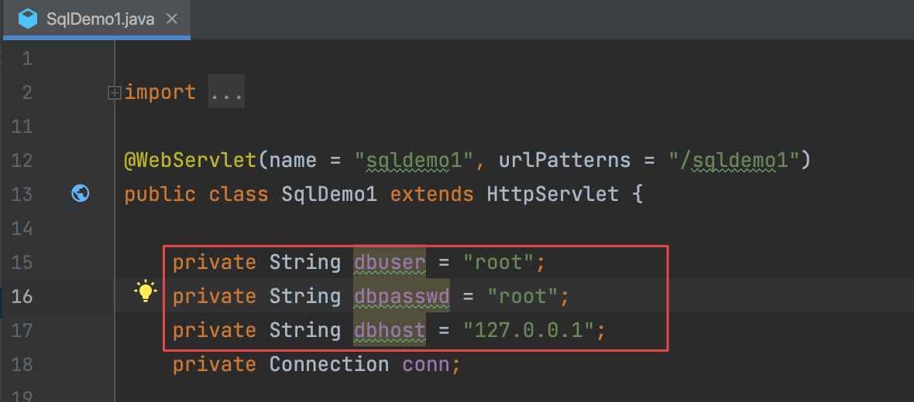
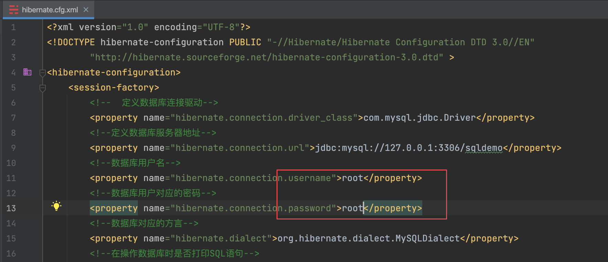
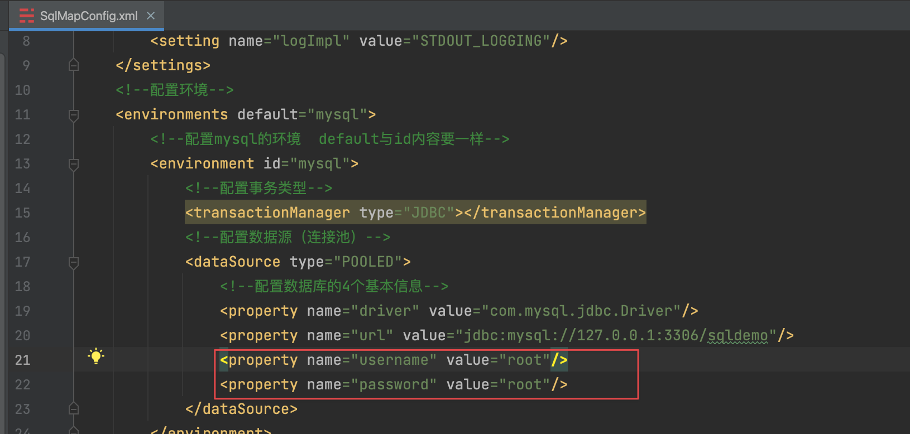
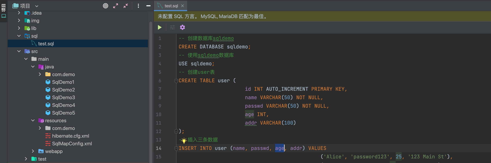
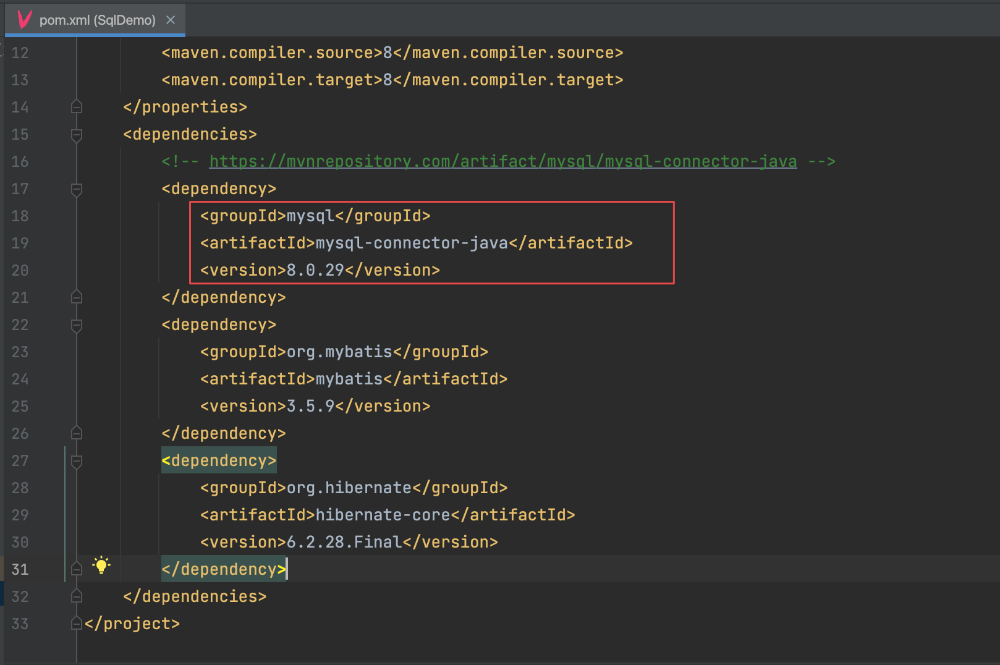
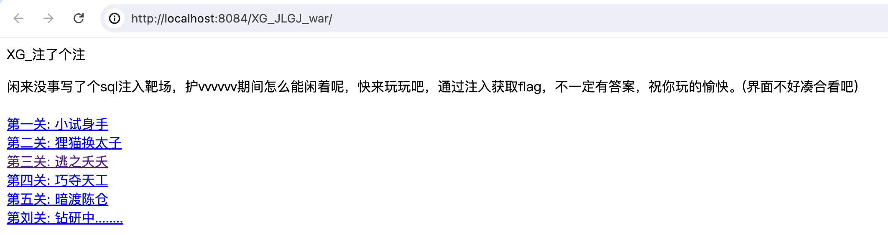

# XG注了个注

来玩玩SQL注入吧


## 配置

1、配置三个文件mysql数据库用户名密码，默认root/root







2、在数据库中执行/sql/test.sql文件



3、更新pom.xml文件mysql数据库驱动版本为自己数据库版本



4、idea配置tomcat后运行


## 开始

访问index.jsp



目前就五关，通过注入获取flag，方式不限，玩的开心

```
公众号: XG小刚
项目链接: https://github.com/xiaogang000/XG_JLGJ
```


